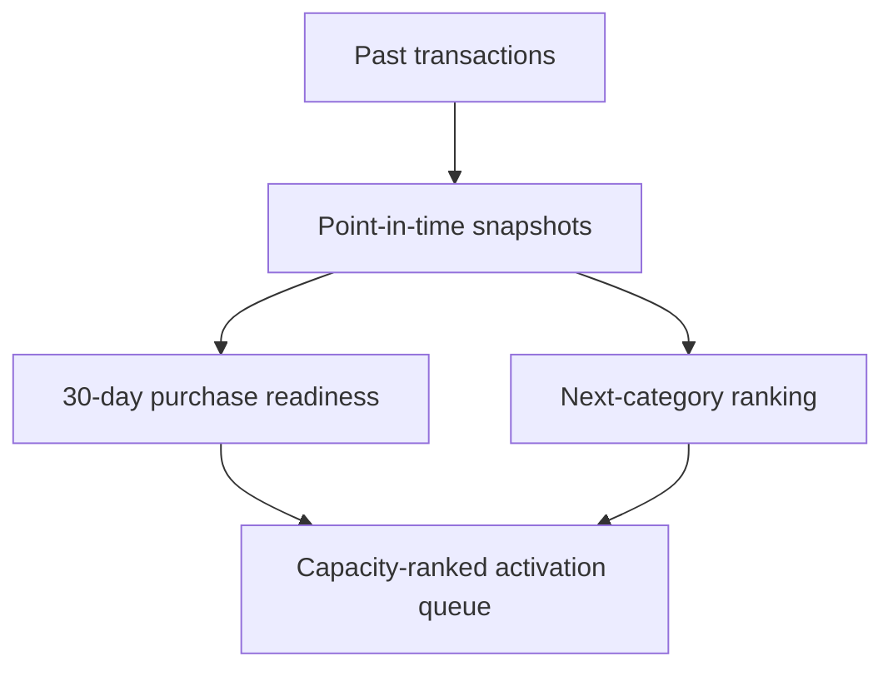
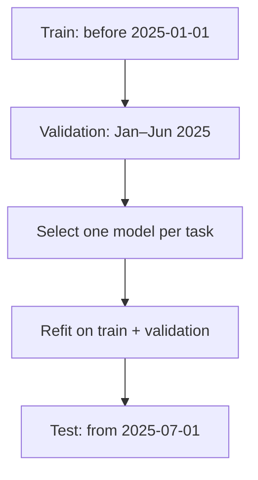

# Customer Next Purchase Recommendation

[](https://github.com/parisaMSTFV/next-purchase-recommendation/actions/workflows/ci.yml)
[](https://www.python.org/)
[](DATA_PROVENANCE.md)

A reproducible customer-analytics case study that separates two decisions:
**when** a customer is likely to purchase and **what category** is most likely
to come next.

The pipeline creates point-in-time customer snapshots, compares transparent
baselines with two machine-learning models, evaluates them on a later untouched
period, and produces a capacity-ranked activation queue for CRM or onsite
personalization.

> All customers, transactions, values, margins, categories, and results are
> synthetic. No employer data, schema, code, or business threshold is used.

## Business question

For each eligible customer:

1. Is a purchase likely within the next 30 days?
2. Which three categories are the strongest candidates for the next purchase?
3. With limited contact capacity, who should be reviewed first?

The project keeps category relevance separate from purchase timing. This avoids
sending a relevant message at the wrong point in the customer's purchase cycle.

## Decision flow



Every feature uses orders strictly before its score date. The readiness outcome
looks 30 days forward. The next-category outcome uses the first purchase within
60 days.

## Validated results

The committed run uses 4,000 simulated customers, 91,154 transactions, 91,339
historical score-date snapshots, and seed `42`.

| Untouched test measure | Selected model | Baseline |
|---|---:|---:|
| Next-category Top-1 hit rate | **54.2%** | 52.2% last category |
| Next-category Top-3 hit rate | **83.7%** | 72.8% last category |
| Mean reciprocal rank | **0.707** | 0.666 last category |
| Category Log Loss | **1.308** | 1.537 last category |
| Readiness Average Precision | **0.771** | 0.658 cadence rule |
| Readiness ROC-AUC | **0.709** | 0.610 cadence rule |
| Readiness Recall at top 20% | **28.5%** | 23.6% cadence rule |
| Readiness Lift at top 20% | **1.42x** | 1.18x cadence rule |

The selected next-category model improves Top-3 hit rate by 10.9 percentage
points over repeating the customer's last category.


### Model selection

The pipeline compares:

- training-set category popularity;
- a smoothed repeat-last-category rule;
- purchase-cycle progress for timing;
- logistic regression;
- histogram gradient boosting.

Histogram gradient boosting won both pre-defined validation selection rules.
For next category, its Top-3 result was nearly tied with logistic regression:
83.94% versus 83.92%. The more complex model was selected because the
[analysis plan](docs/analysis_plan.md) fixes Top-3 hit rate as the primary
criterion before the test period is evaluated.


Category-level test coverage remains between 81.9% and 86.2% for Top-3 recall,
so the portfolio result is not produced by one dominant category alone.


## From prediction to an activation queue

The final score is a transparent prioritization heuristic:

```text
Action score =
P(purchase within 30 days)
× P(recommended category is next | purchase within 60 days)
× historical median category margin
```

The highest-ranked 15% of eligible customers enter `Priority`; the next 25%
enter `Review`; the rest remain in `Monitor`. The latest synthetic scoring run
contains 3,999 eligible customers and places 599 in Priority.


This score is not an uplift estimate. It ranks likely, relevant, and
historically valuable opportunities; a randomized holdout is still required to
measure whether a message, offer, or channel creates incremental behavior.

## Evaluation design



- Model selection uses validation only.
- The untouched test period is evaluated once after refitting.
- Category quality uses Top-K metrics, mean reciprocal rank, Log Loss, and
  multiclass Brier score.
- Readiness uses Average Precision, ROC-AUC, Brier score, and capacity-based
  Recall and Lift.
- A leakage test changes future transactions and confirms that historical
  features remain identical.

## Repository structure

```text
src/next_purchase/       simulation, features, models, evaluation, decisions
tests/                   leakage, metrics, queue, simulation, and pipeline tests
docs/                    analysis plan, metric dictionary, model card, interview guide
reports/                 reproducible metrics, tables, figures, and decision note
scripts/                 public-file sensitive-content check
.github/workflows/       CI for Python 3.11 and 3.12
```

Generated row-level transactions and model snapshots are written to
`data/generated/` and excluded from Git. Only compact aggregate reports and a
30-row synthetic recommendation sample are committed.

## Reproduce the project

Python 3.11 or later is required.

```bash
python -m venv .venv
source .venv/bin/activate
python -m pip install -e ".[dev]"
make run
make check
```

On Windows PowerShell, activate the environment with:

```powershell
.venv\Scripts\Activate.ps1
```

The complete pipeline regenerates all report tables and figures.

## Documentation

- [Analysis plan](docs/analysis_plan.md)
- [Metric dictionary](docs/metric_dictionary.md)
- [Model card](docs/model_card.md)
- [Interview guide](docs/interview_guide.md)
- [Data provenance](DATA_PROVENANCE.md)
- [Reproducible run summary](reports/run_summary.md)
- [Decision note](reports/decision_note.md)
- [Recommendation sample](reports/recommendations_sample.csv)

## Limitations

- Customers need at least three historical purchases; a separate cold-start
  policy is required for newer customers.
- Synthetic behavior simplifies availability, prices, exposure history,
  returns, cancellations, consent, and channel constraints.
- The category model is conditional on a purchase occurring within 60 days.
- Historical category margin is not customer-level incremental value.
- Production use requires point-in-time data controls, drift and calibration
  monitoring, inventory and eligibility rules, and controlled experiments.

## License

MIT
